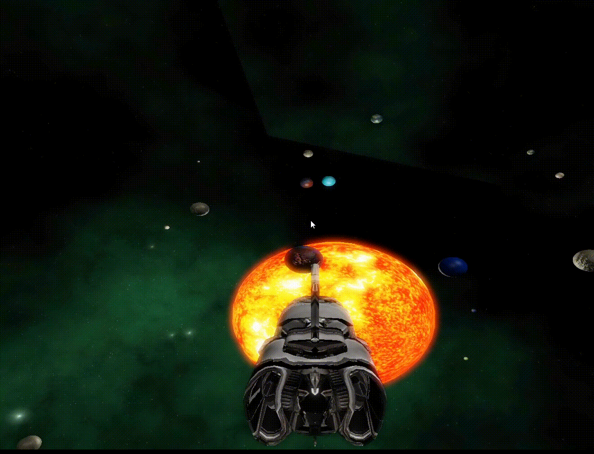

# Spaceship-Flight

Space exploration project.

## Stack

- C++
- OpenGL
- Nvidia's PhysX

## Runbooks

1. Clone repo
2. Open solution in Visual Studio (2022 preferred)
3. Build project in Release or Debug mode

## Keymap

- `w`, `s` - moving forward and backward
- `f` - slowing down
- `a`, `d` - moving across ship's axis (roll)
- vertical mouse movements - pitch
- horizontal mouse movements - yaw
- `u`, `j`, `i`, `k` - changing camera view
- `e`, `r` - changing `bloom` settings
- `y` - enabling or disabling `Discrete LOD` (`Discrete Level Of Detail` - enabled means better performance)
- `esc` - quit

## Features

- Physics implemented with usage of Nvidia's PhysX library
	- Collisions
	- Steering affected by physics forces
- HDR and Bloom
- Particles - ship is covered in smoke after collisions (each collision smoke is more intensified)
- Skybox - background
- Randomly generated asteroid fields, planets, moons
- Bump mapping
- Phong lighting
- 4 different light sources

## Preview

### HDR, Bloom

### Steering, collisions, particles

### Exploration

